# Surface Touch Localization
Touch localization on a tabletop with the use of multiple microphones.

## Idea
A basic interaction is the tapping of interface elements with your finger. On a tabletop touch sensors are expensive and complex to install. The recognition via camera (as Kinect) is unreliable due to the low depth resolution. An alternative is the detection by the noise which is generated by the finger contact with the table surface. For this four microphones are attached to the table surface which then determine the position by latency differences of the sonic.

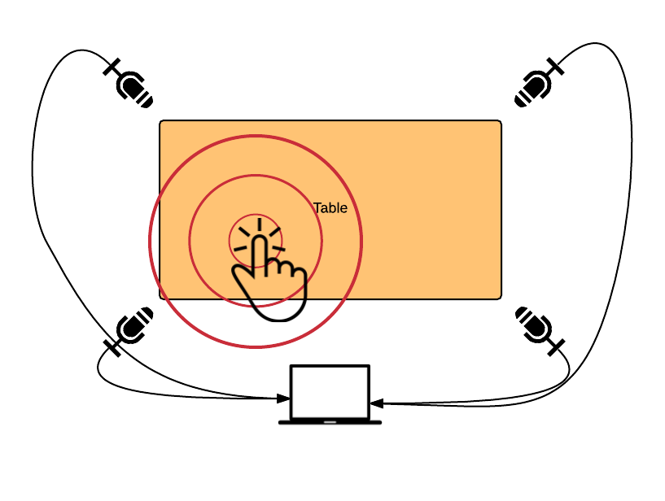
*Vision*

In this project the localisation has been done by time difference on arrival (TDOA).

## Hardware

### Pipeline
The hardware pipelien consists of a table, four microphones, one pre amplifier and an audio interface. All these componets have been evaluated and testet before the experiments.

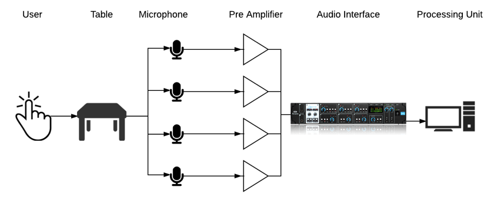
*Hardware Pipeline*

### Experiment Setup
This is the final setup with following hardware components:

* 4 Voice Microphones
* Behringer Ultragain Pro 8 Digital Amplifier
* Saffire Pro 14 Audio Interface

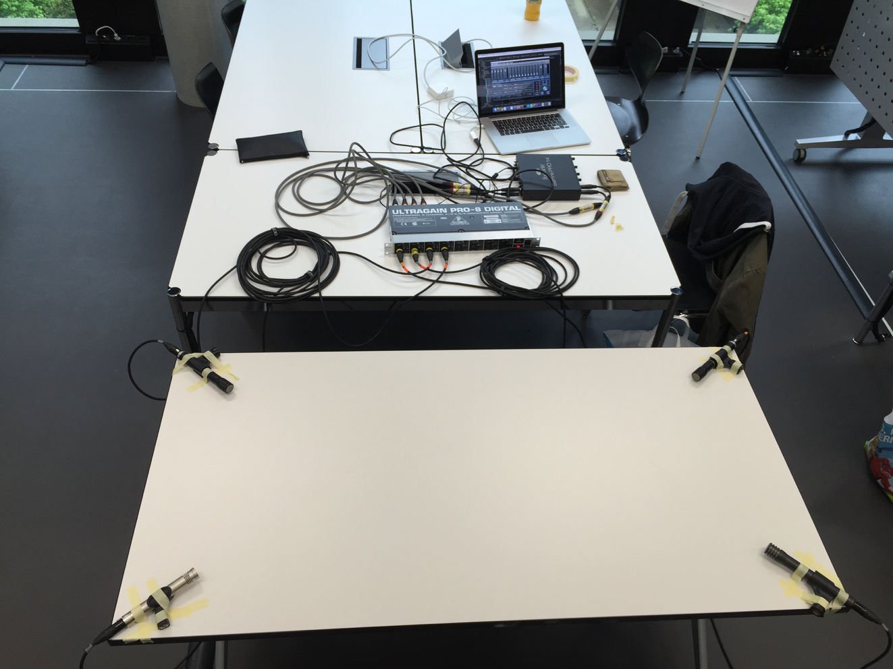
*Experiment*

## Software

### Audio Pipeline
The audio pipline is based on the EtherGL multimedia framework. This framework allows to create filters and effects which then are injected into the pipeline.

To smooth the signal filters and dcremove have been used. All the audio signals are stored in a ring buffer which then overwrites the old data.

If a feature is detected the analyze software is going to analyze the delay and runs the positioning algorithms.

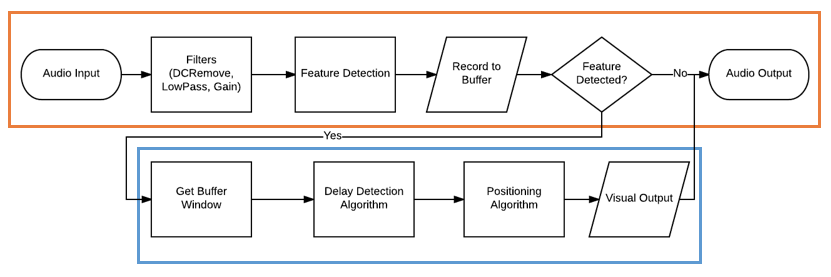
*Audio Pipeline*

### Feature Detection
The feature detection is done by a simple thresholding approach. If the signal is louder than a given threshold, the software recognizes this as a touch on the table.

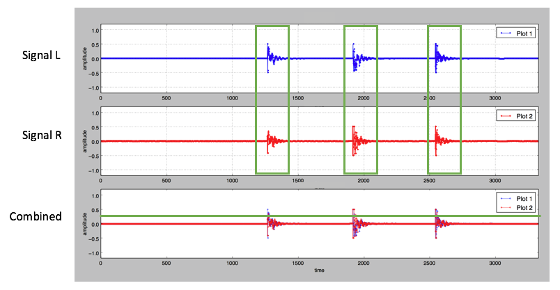
*Feature Detection*

### Delay Detection
Three methods were used to detect the delay of two singals. The best results have been achieved with cross-correlation of the two signals.

*Cross Correlation Delay*

### Algorithms

#### Linear
This linear algorithm uses time shift caluclation to determine the **x** and **y** position of the signal. This is done by shifting the center point of the signal by the delay between two microphones.

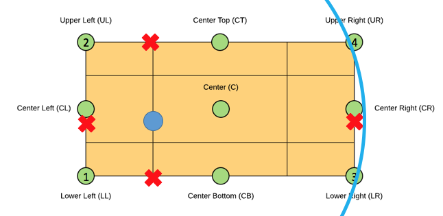
*Linear Algorithm*

The results were only accurate on the horizontal axis. This is because the two microphones **UL** and **LL** aswell as **UR** and **LR** are too close together to measure a good delay.

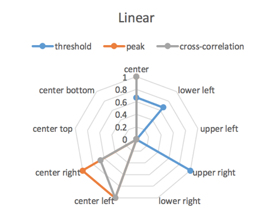
*Linear Spider*

#### Diagonal
The diagonal algorithm tries to fix this problem and uses the longest possible way over the table. Again with the center shift method it is possible to find the origin of the signal.

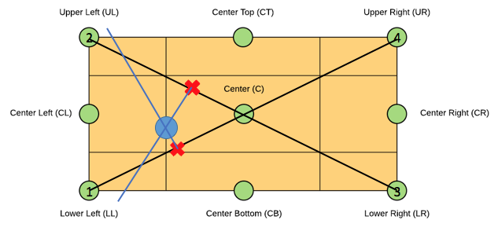
*Diagonal Algorithm*

It performed very well, even on the vertical axis.

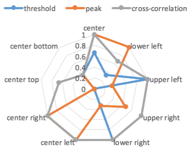
*Diagonal Spider*

#### DIWL
DIWL tries to find the origina point by inverting the sonic waves and calculate their relative position to the time. This is an approximative algorithm.

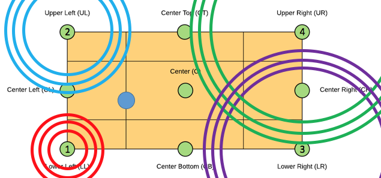
*DIWL Freeze*

At the pont where all sonic waves intersect there should be the origin of the signal.

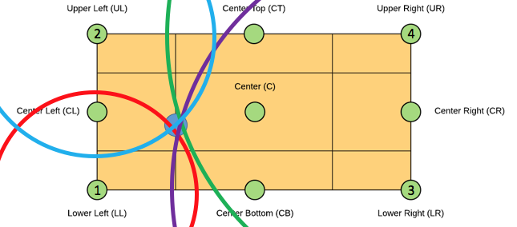
*DIWL Localisation*

DIWL was a bit disappointing because it could not show its strength in the field test.

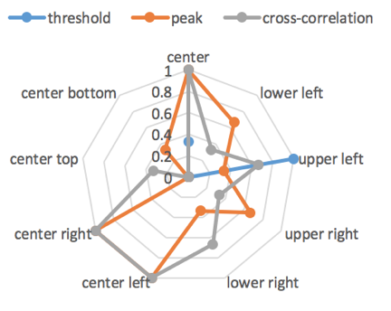
*DIWL Spider*

### Result
In the experiment three test clicks on every point of the table (UL, CL, ...) have been done. The overall accuracy shows how well the algorithms with which delay method worked.

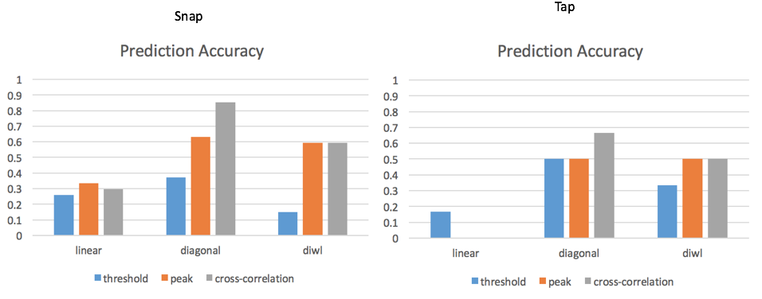
*Accuracy of algorithms*

Tapping was not as good as snapping because of table vibrations which then jammed the lag detection.

### Proof of Concept
The software of the poc was splitted up into two windows. One for recording and one for analyzing the results.

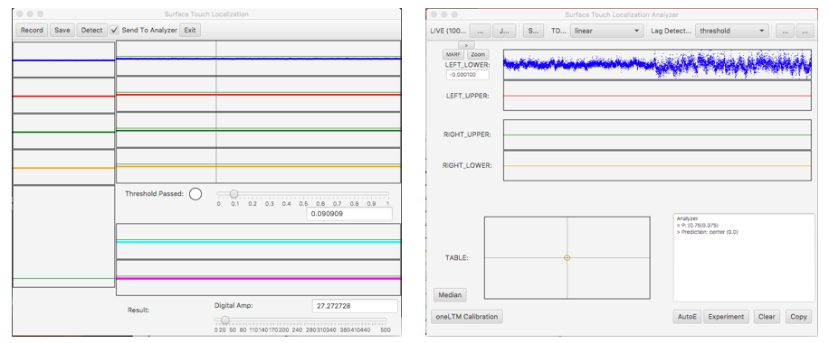
*Software POC*

## About
*Developed by Florian Bruggisser 2016*
